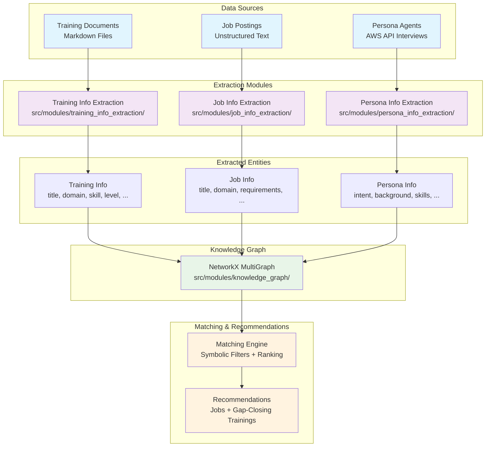

# GDSC – Neuro‑Symbolic Talent & Jobs/Training Matching

**Part of the [Capgemini Global Data Science Challenge](https://www.capgemini.com/insights/research-library/global-data-science-challenge/)** — Contributing to **UNICEF's Green Rising initiative** to empower youth with skills and employment opportunities in the green economy.

A **neuro‑symbolic** solution that:

- **Extracts** structured information from **training course descriptions** and **job postings** using LLMs with robust fallbacks and canonicalizers,
- **Builds a Knowledge Graph (KG)** of personas, jobs, trainings, skills, domains, cities, and languages,
- **Engages with 100 persona agents** (LLMs behind an endpoint) and **matches** them to jobs & trainings through **symbolic filters** and **graph-based reasoning**.

---

## Table of Contents
- [Architecture](#architecture)
- [Repository Structure](#repository-structure)
- [Installation](#installation)
- [Usage](#usage)
  - [Training Info Extraction](#training-info-extraction)
  - [Job Info Extraction](#job-info-extraction)
  - [Persona Info Extraction](#persona-info-extraction)
  - [Knowledge Graph & Matching](#knowledge-graph--matching)
  - [Notebooks](#notebooks)
- [Acknowledgments](#acknowledgments)

---

## Architecture

This system implements a **neuro-symbolic approach** that combines LLM-based extraction with structured reasoning for talent and job/training matching.



### Pipeline Overview

1. **Data Extraction & Structuring**
   - **Training Extraction** (`src/modules/training_info_extraction/`)
     - LLM-assisted extraction: title, domain, skill, level (Basic/Intermediate/Advanced)
     - Robust parsing with title-based heuristics and canonicalization
     - Skills cataloging and resume-friendly processing
   
   - **Job Extraction** (`src/modules/job_info_extraction/`)
     - Domain classification using "tournament" approach
     - Skills extraction constrained to domain→skills allowlists
     - ROME integration for domain stability
   
   - **Persona Extraction** (`src/modules/persona_info_extraction/`)
     - Multi-phase conversational interviews using LangGraph state machines
     - AWS persona API integration for real-time conversations
     - Incremental profile building with domain-aware validation

2. **Knowledge Graph Construction** (`src/modules/knowledge_graph/`)
   - NetworkX MultiGraph connecting: personas ↔ jobs ↔ trainings ↔ skills ↔ domains
   - Node types: personas, jobs, trainings, skills, domains, cities, languages
   - Relationship modeling with typed edges and attributes

3. **Symbolic Matching & Reasoning**
   - Hard filters: domain compatibility, language overlap, location/relocation preferences
   - Education and experience ladder validation
   - Ranking algorithms with same-city evaluation and skills coverage analysis
   - Gap-closing recommendations for skill development pathways

### Sustainability: Emissions Tracking

The **persona info extraction pipeline** includes a simple **carbon emissions tracking** to estimate the environmental impact of LLM usage during the interview process. Emissions are calculated based on token consumption.


This feature aligns with UNICEF's Green Rising initiative by promoting responsible AI usage and environmental awareness in technology solutions.

---

## Repository Structure

```
gdsc_2025/
├── 📁 src/                         # Main source code
│   ├── 📁 common/                  # Common utilities
│   └── 📁 modules/                 # Core extraction and processing modules
│       ├── 📁 training_info_extraction/
│       ├── 📁 job_info_extraction/
│       ├── 📁 persona_info_extraction/
│       └── 📁 knowledge_graph/
├── 📁 notebooks/                   # Jupyter notebooks for development and analysis
│   ├── 📄 Training_Info_Extraction.ipynb          # Training data extraction workflow
│   ├── 📄 Job_Info_Extraction.ipynb               # Job data extraction workflow
│   ├── 📄 PersonaInfo_Extraction.ipynb            # Persona interview system (original)
│   ├── 📄 PersonaInfo_Extraction_Pipeline.ipynb   # Persona extraction using pipeline functions
│   ├── 📄 Knowledge_Graph_and_Submission.ipynb    # KG building and final results
│   └── 📄 Evaluate Results.ipynb                  # Results analysis and eval
```

### Key Components

- **📁 src/modules/**: Core extraction modules following consistent patterns
  - Each module has its own `README.md`, `pipeline.py`, `llm_client.py`, and utilities

- **📁 notebooks/**: Interactive development and analysis workflows
  - End-to-end pipelines for each extraction type
  - Comprehensive knowledge graph building and evaluation
  - Results analysis and submission preparation
---

## Installation

This repository uses **[uv](https://github.com/astral-sh/uv)** with `pyproject.toml` and `uv.lock` for dependency resolution.

```bash
# 1) Install uv (one‑liner installer)
curl -LsSf https://astral.sh/uv/install.sh | sh
# or on Windows (PowerShell)
# irm https://astral.sh/uv/install.ps1 | iex

# 2) Create & activate a virtual environment
uv venv
source .venv/bin/activate   # Windows: .venv\Scripts\activate

# 3) Sync dependencies from uv.lock
uv sync
```

**Environment variables** are loaded from a root `.env` file.

```env
# .env (repo root)
MISTRAL_API_KEY=xxxxxxxxxxxxxxxx
```

---

## Usage

### Training Info Extraction

```python
from pathlib import Path
from src.modules.training_info_extraction.pipeline import extract_trainings_one_skill

TRAININGS_DIR = Path("../../GDSC-8/data/trainings")
OUT_DIR = Path("../processed_data/outputs")
JOBS_CSV = Path("../processed_data/jobs_extracted_labels_en_blocked.csv")

jsonl_path, csv_path = extract_trainings_one_skill(
    trainings_dir=TRAININGS_DIR,
    out_dir=OUT_DIR,
    jobs_csv_path=JOBS_CSV,  # derives allowed domains
    jobs_csv_domain_column="libelle_domaine_professionel_en",
    model="mistral-medium-latest",
    max_files=0,
    sleep_seconds=0.3,
    resume=True,
)
print(jsonl_path, csv_path)
```

### Job Info Extraction

```python
from src.modules.job_info_extraction.pipeline import extract_jobs_pipeline
from pathlib import Path

jobs_dir = Path("../../GDSC-8/data/jobs")
output_dir = Path("../processed_data/outputs")

# Extract structured job information
job_results = extract_jobs_pipeline(
    jobs_dir=jobs_dir,
    output_dir=output_dir,
    model="mistral-medium-latest",
    max_jobs=100,
    resume=True
)

print(f"Extracted {len(job_results)} job postings")
```

### Persona Info Extraction

```python
from src.modules.persona_info_extraction.pipeline import main_interview_pipeline
from src.agents import get_agent

# Run complete persona interview
result = main_interview_pipeline(
    persona_id="persona_001",
    get_agent=get_agent,
    model_id="mistral-medium-latest",
    max_turns_p1=5,
    max_turns_p2=5
)

if "error" not in result:
    profile = result["profile"]
    print(f"Interview completed for: {profile['full_name']}")
    print(f"Domain: {profile['top_domain']}")
    print(f"Focus: {profile['current_focus']}")
    print(f"Technical Skills: {profile['technical_skills']}")
```

**Direct profile extraction from transcript:**

```python
from src.modules.persona_info_extraction.extraction import extract_and_merge_profile

profile = extract_and_merge_profile(
    extractor_agent=get_agent("extractor"),
    intent_agent=get_agent("intent"),
    transcript="User: I want to learn about food processing...",
    persona_id="persona_001",
    allowed_skills={"Food Industry": ["Food Safety", "Recipe Scaling", ...]},
    known_job_domains=["Food Industry", "Paper Industry", ...]
)
```

### Knowledge Graph & Matching

```python
from src.modules.knowledge_graph.graph import build_kg, save_graph
from src.modules.knowledge_graph.utils import load_bundle
from src.modules.knowledge_graph.matching import recommend_jobs_strict, trainings_to_close_gaps_strict

personas, jobs, trainings = load_bundle(
    "../submissions/personas_merged_reassigned_domains.json",
    "../submissions/extracted_jobs_merged.json",
    "../submissions/extracted_trainings_backfilled.json",
)
G = build_kg(jobs, trainings, personas)
save_graph(G, "../processed_data/outputs/kg.gpickle")

persona_id = next(iter(personas.keys()))
recs = recommend_jobs_strict(G, persona_id, top_k=10)
if recs:
    job_id, meta = recs[0]
    gaps = trainings_to_close_gaps_strict(G, persona_id, job_id, top_per_level=1)
    print(job_id, meta, gaps)
```

### Notebooks

Interactive Jupyter notebooks for development, testing, and analysis:

#### Core Extraction Workflows
- **`Training_Info_Extraction.ipynb`** — Complete training data extraction pipeline
  - LLM-assisted extraction from markdown training descriptions
  - Domain classification, skill extraction, and level assessment
  - Cleaning, relabeling, and skill organization
  
- **`Job_Info_Extraction.ipynb`** — Job posting analysis and extraction
  - Unstructured text processing and domain classification
  - Required skills extraction with domain constraints
  - ROME integration and validation workflows

- **`PersonaInfo_Extraction.ipynb`** — Interactive persona interview system (original)
  - Multi-phase conversational interviews using LangGraph
  - AWS persona API integration and conversation management
  - Profile extraction, validation, and persistence

- **`PersonaInfo_Extraction_Pipeline.ipynb`** — Persona extraction using refactored pipeline functions
  - Demonstrates usage of `src/modules/persona_info_extraction/pipeline.py`
  - Batch processing, validation, and emissions tracking
  - Cleaner implementation using modular functions

#### Analysis and Integration
- **`Knowledge_Graph_and_Submission.ipynb`** — Knowledge graph construction and evaluation
  - NetworkX MultiGraph building from extracted data
  - Matching algorithm testing and validation
  - Final results compilation and submission preparation

- **`Evaluate Results.ipynb`** — System performance analysis
  - Extraction quality assessment and metrics
  - Knowledge graph statistics and coverage analysis
  - Recommendation system evaluation

These notebooks provide examples and can be used as starting points for custom workflows or integration testing.


---

## Acknowledgments

This solution was built as part of the **GDSC-8 Challenge** and would not have been possible without the support and contributions of:

- **GDSC-8 Team** — For organizing this challenge and providing the opportunity to work on such an impactful problem in talent development and job matching.
- **AWS** — For providing the infrastructure, API endpoints, and technical support that enabled the persona interview system and scalable processing.
- **Mistral AI** — For providing the powerful LLM capabilities that drive the neuro-symbolic extraction pipelines at the core of this system.
- **UNICEF** — For their commitment to education, skills development, and economic opportunity, which inspired the mission behind this project.

This implementation builds upon the foundation provided by the official GDSC-8 repository: **[cg-gdsc/GDSC-8](https://github.com/cg-gdsc/GDSC-8)**

---
